# **Business Intelligence:**

## -  What is Busniess Intelligence ?

### Business intelligence (BI) is the process of transforming data into actionable insights that help a company make strategic and tactical decisions. Is often used to describe a collection of resources that provide fast, easy-to-understand access to data-driven insights about an organization’s current state.

<br />

## - Why use Business Intelligance:


<br />

## - Descriptive, Predictive & Prescriptive Analytics:


### **1. Descriptive Analytics:** 

 + ### Descriptive analytics is often considered the first start in data analytics. Descriptive analytics takes massive amounts of historical data and turns it into digestible chunks. It is the process of deciphering what happened in the past and turning it into something interpretable for the past. It can be helpful to understand past behaviors and consider future outcomes. Most descriptive analytics falls in line with statistical modeling.
 > - (Using Visualizations and Reports).

<br />

### **2. Descriptive Analytics:**
+ ### Businesses can leverage predictive analytics by using statistics, computational modeling and machine learning to identify new sources of data and competitive insights. Using historical data as a guideline with a known set of outcomes, patterns can be found to predict future actions with a surprising degree of accuracy. It enables the business to forecast on what may happen in the future based on probabilities. Think of this data type as information that can be rolled back into multiple channels for the business. We have seen it leveraged in financial modeling, supply chain, logistics and transportation, productivity monitoring, order processing, and more. It offers the business a means to provide actionable insights with your data.


<br />

### **3. Prescriptive Analytics**
- ### Prescriptive analytics goes even further than descriptive and predictive analytics by allowing a data analyst or scientist to “prescribe” on possible outcomes through data insights, such as past business outcomes, new algorithms, and advanced statistical modeling. You can leverage data and prescriptive analytics to predict trends, future behavior patterns, and finally provide business decision trees to take full advantage of your data insights.


<br />

------------------------------------

## ***- Data Importing:***

1. ### How to import Data from CSV,Excel and Web files. ✅
2. ### After importing data we do some Visualizing. ✅
3. ### Import Real-time Streaming Data using Power bi and PubNub webpage then create a Dashboard. ✅
4. ### Install SQL Server and import data to Power BI. ✅

5. ### Import Data from OData feed and from Folders in Power BI. ✅

6. ### Dataflow and how to create Gateway and Entitiies. ✅

-------------------------------------

## **What are Dashboards:**
### A Power BI dashboard is a single page, often called a canvas, that uses visualizations to tell a story. Because it is limited to one page, a well-designed dashboard contains only the most-important elements of that story. The visualizations you see on the dashboard are called tiles and are pinned to the dashboard from reports.


<br />


<br />

## - **Dashboard Menu**:


<br />


------------------------------------

## ***- Data Cleaning:***

1. ### How to remove Rows. ✅
2. ### How to remove Columns. ✅
3. ### How to make rows as first headers. ✅
4. ### How to create columns. ✅
5. ### How to remove duplicates. ✅
6. ### How to unpivot columns and  split them. ✅

> ___NOTE:___  The `PIVOT` is used to convert table rows into columns, while the `UNPIVOT` converts columns back to rows.

>To finde `Unpivot Columns` we need to go to `Transform`.

7. ### How to change Data type and replace values. ✅
8. ### How to append and merge Queries by combine the files into one. (States file into one) ✅

> ___NOTE___:  
 **- Append:** means results of two (or more) queries (which are tables themselves) will be combined into one query.\
**- Merge:** is another type of combining queries which are based on matching rows, rather than columns. The output of Merge will be a single query

--------------------------------------------

## ***- Visuals:***

- ### What chats or graph is right to use ? ✅


<br />

- ### Visualisations Properties: ✅


<br />

1. ### **Bar Chart:** highlight differences between categories, clearly show trends and outliers, and reveal historical highs and lows at a glance. ✅

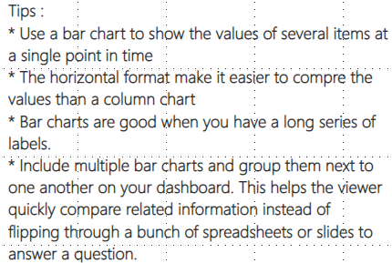

<br />

2. ###  __Line chart:__ is often used to visualize a trend in data over intervals of time – a time series – thus the line is often drawn chronologically. ✅

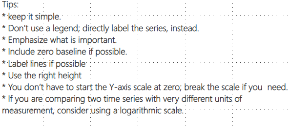


<br />

3. ### __Pie graph (or pie chart):__ is a specialized graph used in statistics. The independent variable is plotted around a circle in either a clockwise direction or a counterclockwise direction.The dependent variable (usually a percentage) is rendered as an arc whose measure is proportional to the magnitude of the quantity. ✅

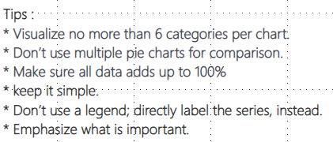

<br />

4. ### __Stacked bar charts:__  is a graph that is used to break down and compare parts of a whole. Each bar in the chart represents a whole, and segments in the bar represent different parts or categories of that whole. ✅

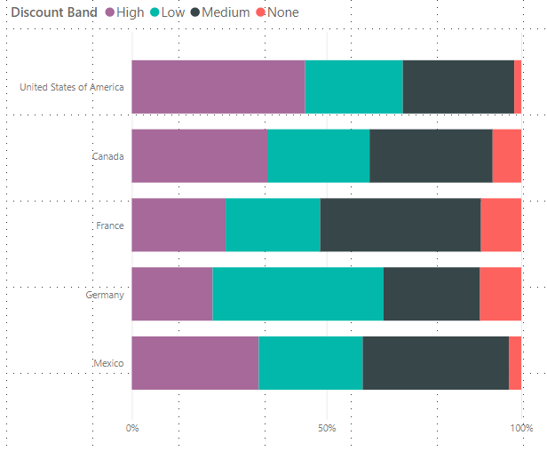
<br />

5. ###  __Clustered column chart:__ displays more than one data series in clustered vertical columns. Each data series shares the same axis labels, so vertical bars are grouped by category. ✅

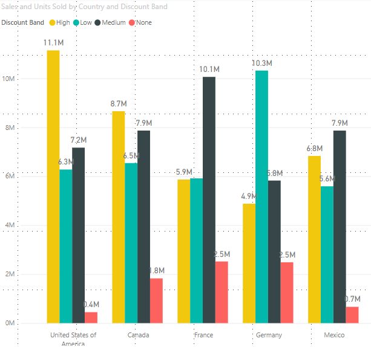

<br />

6. ### __Area charts:__ emphasize the magnitude of change over time, and can be used to draw attention to the total value across a trend. For example, data that represents profit over time can be plotted in an area chart to emphasize the total profit. ✅

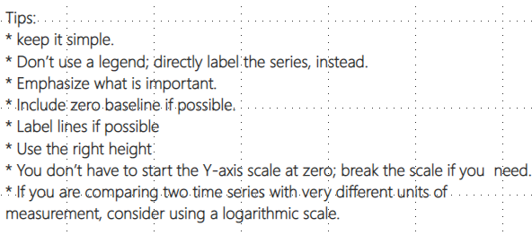


<br />

7. ### __Combo chart:__ is the combination of two charts. A combo chart is a single visualization that combines a line chart and a column chart. Combining the 2 charts into one lets you make a quicker comparison of the data.

### -  Combo charts are a great choice:

* when you have a line chart and a column chart with the same X axis.
* to compare multiple measures with different value ranges.
* to illustrate the correlation between two measures in one visualization.
* to check whether one measure meet the target which is defined by another measure
* to conserve canvas space.

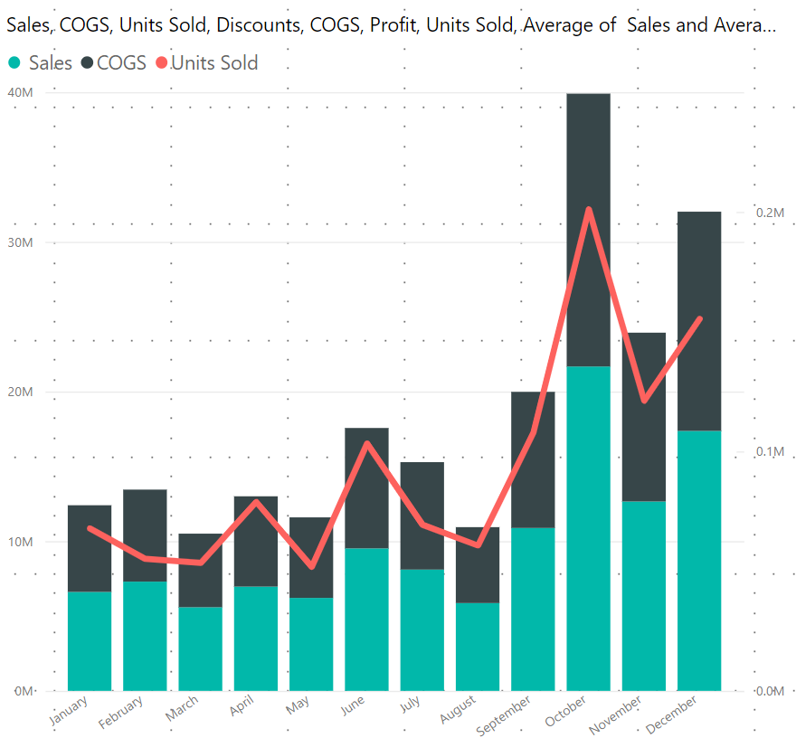

<br />

8. ### __Scatter chart:__ always has two value axes to show one set of numerical data along a horizontal axis and another set of numerical values along a vertical axis. The chart displays points at the intersection of an x and y numerical value, combining these values into single data points. Scatter plots are an effective way to give you a sense of trends, concentrations and outliers that will direct you to where you want to focus your investigation efforts further.

<br />

### - Scatter Charts are a great choice :
* to show relationships between 2 (scatter).
* to plot two groups of numbers as one series of xy coordinates.
* instead of a line chart when you want to change the scale of the horizontal axis
* to turn the horizontal axis into a logarithmic scale.
* to display worksheet data that includes pairs or grouped sets of values. In a scatter chart, you can adjust the independent scales of the axes to reveal more information about the grouped values.
* to show patterns in large sets of data, for example by showing linear or non-linear trends, clusters, and outliers.
* to compare large numbers of data points without regard to time. The more data that you include in a scatter chart, the better the comparisons that you can make.

<br />

9. ### __Treemaps:__ display hierarchical data as a set of nested rectangles. Each level of the hierarchy is represented by a colored rectangle (often called a "branch") containing other rectangles ("leaves"). The space inside each rectangle is allocated based on the quantitative value being measured, with the rectangles arranged in size from top left (largest) to bottom right (smallest). If you are looking to see your data at a glance and discover how the different pieces relate to the whole? Then treemaps are for you. These charts use a series of rectangles, nested within other rectangles, to show hierarchical data as a proportion to the whole.

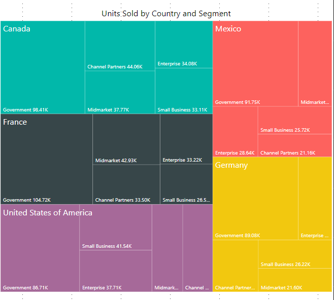

<br />

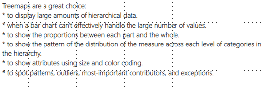

<br />

10. ### __Funnel chart:__ helps you visualize a linear process that has sequential connected stages. At a glance, the shape of the funnel conveys the health of the process you're tracking. Each funnel stage represents a percentage of the total. So, in most cases, a funnel chart is shaped like a funnel with the first stage being the largest, and each subsequent stage smaller than its predecessor. ✅

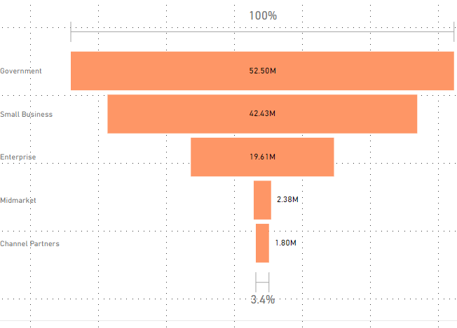

<br />

### - Funnel charts are a great choice:
* when the data is sequential and moves through at least 4 stages.
* when the number of "items" in the first stage is expected to be greater than the number in the final stage.
* to calculate potential (revenue/sales/deals/etc.) by stages.
* to calculate and track conversion and retention rates.
* to reveal bottlenecks in a linear process.
* to track a shopping cart workflow.
* to track the progress and success of click-through advertising/marketing campaigns.

<br />

### - Funnel charts:
* Can be pinned from reports and from Q&A.
* Can be sorted.
* Support multiples.
* Can be highlighted and cross-filtered by other visualizations on the same report page.

<br />

11. ### __Card charts:__ Sometimes a single number is the most important thing you want to track in your Power BI dashboard or report, such as total sales, market share year over year, or total opportunities.

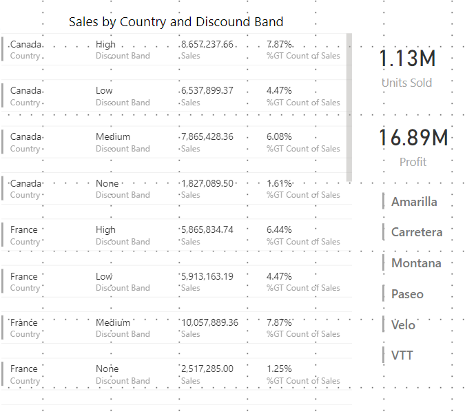

<br />

12. ### __Guage Chart:__ A radial gauge chart has a circular arc and displays a single value that measures progress toward a goal/KPI. The goal, or target value, is represented by the line (needle). Progress toward that goal is represented by the shading. And the value that represents that progress is shown in bold inside the arc. All possible values are spread evenly along the arc, from the minimum (left-most value) to the maximum (right-most value). Till now we are discussing visualization comparing different catetories and different values. Sometimes you want to track single value and metric that changes over time that shows you the progress towards particular target. ✅

<br />

### - Radial gauges are a great choice to:
* show progress toward a goal.
* represent a percentile measure, like a KPI.
* show the health of a single measure.
* display information that can be quickly scanned and understood.

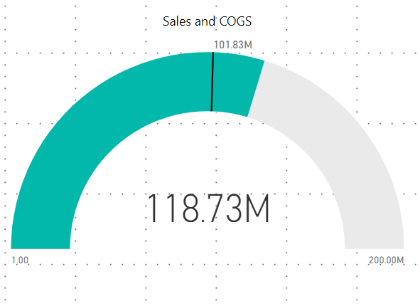

<br />

13. ### __KPIs:__A Key Performance Indicator (KPI) is a visual cue that communicates the amout of progress made toward a measureable goal. A Key Performance Indicator (KPI) is based on a specific measure and is designed to help you evaluate the current value and status of a metric against a defined target. Therefore, a KPI visual requires a base measure that evaluates to a value and a target measure or value, and a threshold or goal. ✅

<br />

### - KPIs are a great choice:
* to measure progress (what am I ahead or behind on?)
* to measure distance to a goal (how far ahead or behind am I?)

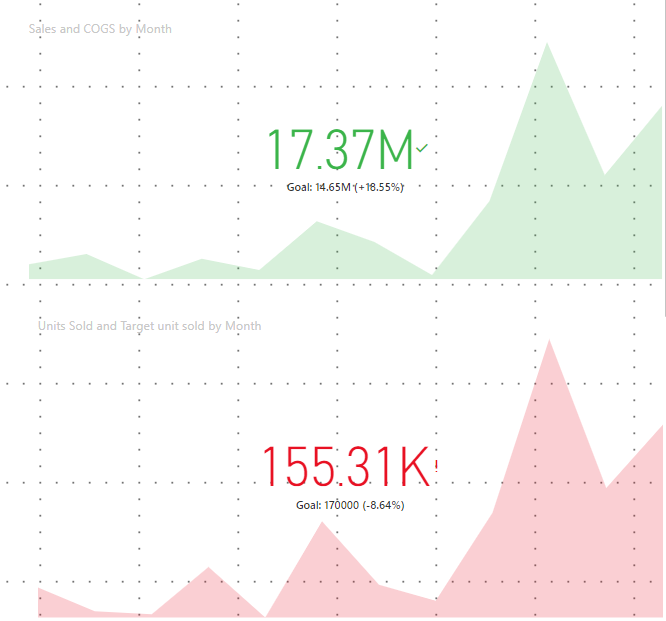

<br />

14.  ### __Matrix:__ A matrix is a grid used to store or display data in a structured format. It is often used synonymously with a table, which contains horizontal rows and vertical columns. While the terms "matrix" and "table" can be used interchangeably, matrixes (or matrices) are considered more flexible than tables. For example, tables generally have a fixed number of rows and columns, while the size of a matrix may change dynamically. The term "matrix" may also be used to refer to a table that has groups of columns within a single row. ✅

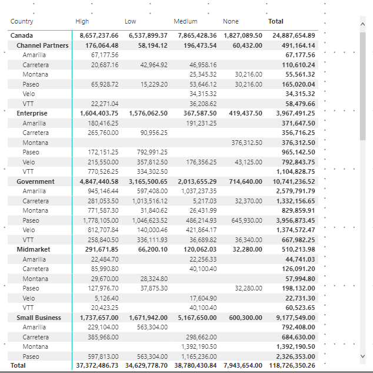

<br />

15. ### __Table:__ is a grid that contains related data in a logical series of rows and columns. It may also contain headers and a row for totals. Tables work well with quantitative comparisons where you are looking at many values for a single category. While the terms "matrix" and "table" can be used interchangeably, matrixes (or matrices) are considered more flexible than tables. For example, tables generally have a fixed number of rows and columns, while the size of a matrix may change dynamically. The term "matrix" may also be used to refer to a table that has groups of columns within a single row. ✅

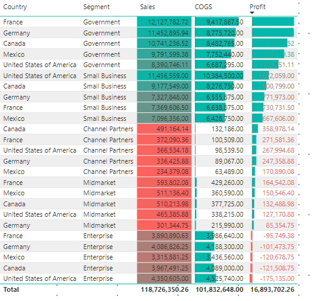

<br />

15. ### **Text Boxes, Image & Shapes:** Sometimes the titles on visualizations aren’t enough to tell the story. Add text boxes to communicate with the people viewing your reports. Text boxes can describe the report page, a grouping of visuals, or describe an individual visual. They can explain results or better-define a visual, components in the visual, or relationships between visuals. Text boxes can be used to draw attention based on different criteria called out in the text box. ✅

### - Tips:

### Create a text style guide and apply it to all pages of your report. Pick just a few font faces, text sizes, and colors. Apply this style guide to not only textual elements but to the font choices you make within your visualizations (see Titles and labels that are part of the visualizations, below). Set rules for when you’ll use bold, italics, increased font size, certain colors, and more. Try to avoid using all capitalization or underlining.


### - Shapes:
### Shapes too can aid navigation and comprehension. Use shapes to group related information together, highlight important data, and use arrows to direct the eye. Shapes help readers understand where to start and how to interpret your report. In design terms, this is often referred to as contrast.
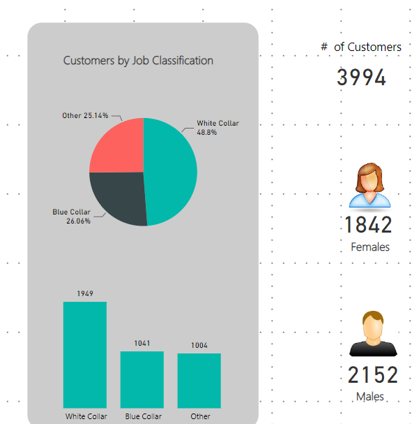

<br />

16. ### **Slicers:**  We use filters on the reports which are hidden on the field tab. When users are viewing the report they will not have access to it. For those times we like to put filters on the canvas which are know as slicers. ✅

### - Slicers are a great choice in the following situations.
* To display commonly-used or important filters on the report canvas for easier access.
* To make it easier to see the current filtered state without having to open a drop-down list to find the filtering details.
* When you want to hide columns you don't need but still be able to use them to filter - this makes for narrower, cleaner tables.
* To create more focused reports - since slicers are floating objects you can put them next to the interesting part of the report you want your users to focus on.

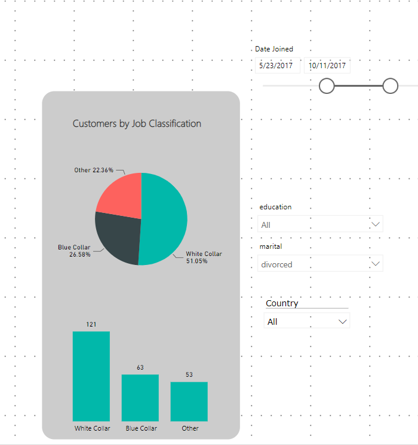

<br />

17. ### **Maps:** When you have any kind of location data – whether it’s postalcodes, states, abbreviations, country names, or your own custom geocoding – this information is most impactful when seen on a map. A map visually locates your data and gives you geographical context for your metrics. A map uses shading or tinting or patterns to display how a value differs in proportion across a geography or region. Quickly display these relative differences with shading that ranges from light (less-frequent/lower) to dark (more-frequent/more). ✅

<br />

### - Tips :  Use it 
* to display quantitative information on a map.
* to show spatial patterns and relationships.
* when your data is standardized.
* when working with socioeconomic data.
* when defined regions are important.
* to get an overview of the distribution across the geographic locations.
* Use maps as a filter for other types of charts, graphs, and tables. Combine a map with other relevant data then use it as a filter to drill into your data for robust investigation and discussion of data.
* Layer bubble charts on top of maps. Bubble charts represent the concentration of data and their varied size is a quick way to understand relative data. By layering bubbles on top of a map it is easy to interpret the geographical impact of
different data points quickly.

------------------------------------------------------------

## ***- Data Modeling:***
- ### A data model is a collection of data, calculations, and formatting rules that combine to create an object that can be used to explore, query, and better understand an existing dataset. ✅

- ### Data Modeling allows to :
    1. Create a data model by joining tables to develop a coherent data structure from multiple separate sources of data. This data model is then used in dashboards.
    2. Enrich the data model by applying coherent names and data types. 
    3. Create calculations and prepare the core metrics that you want to use in your analysis and presentations. 

<br/>

### -  **Database normalization:** is the process of organizing the fields and tables of a relational database to minimize redundancy. Normalization usually involves dividing large tables into smaller (and less redundant) tables and defining relationships between them. The objective is to isolate data so that additions, deletions, and modifications of a field can be made in just one table and then propagated through the rest of the database using the defined relationships.


###  - **Denormalization:** is the process of attempting to optimize the read performance of a database by adding redundant data or by grouping data.In some cases, denormalization is a means of addressing performance or scalability in relational database software.
<br />

## - **Star Schema vs Snowflake Schema:** 
- ### Normalization is a key difference between star and snowflake schemas. 
- ### Snowflake schemas will use less space to store dimension tables. This is because as a rule any normalized database produces far fewer redundant records .
- ### Denormalized data models increase the chances of data integrity problems. These issues will complicate future modifications and maintenance as well.

### -  Which one to use Snowflake : 
    * In data warehouses.
    * When dimension tables require a significant amount of storage space.
    * If you use tools that require a snowflake schema in the background.

### - Which one to use Star : 
    * In data marts

### ***Star Schema:***

    - Denormalized Dimensions.
    - Fact Tables Surrounded by Dimension Tables.
    - May have data integrity and storage issues.

### ***Snowflake Schema:***

     - Dimensions are Normalized.
     - Data storage and Integrity issues resolved.
     - Join Complexity Increases.
     - Time in queries may increase. 

<br/>

Snowflake            |  Star
:-------------------------:|:-------------------------:
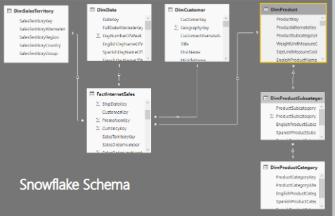  |  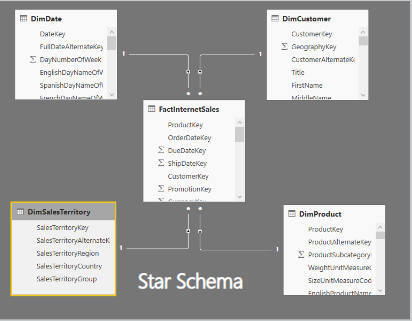 

<br />

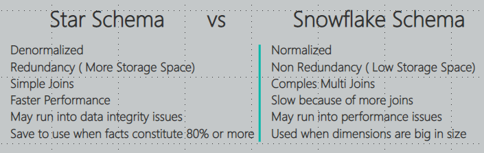 

---------------------------


## <center> **DAX** </center>

## - DAX Reference [Link](https://learn.microsoft.com/en-us/dax/dax-function-reference).

- ### ***DAX:*** is a functional language, which means the full executed code is contained inside a function.
- ### In DAX, functions can contain other, nested functions, conditional statements, and value references. Execution in DAX starts from the innermost function or parameter, and works outward. In Power BI, DAX formulas are written in a single line, so formatting your functions correctly is important for readability.
- ### DAX is designed to work with tables, so it has just two primary data types: Numeric and Other. Numeric can include integers, decimals, and currency. Other can include strings and binary objects. This means that if you build your DAX function to work on one type of number, you can be assured that it will work on any other Numeric data.
- ### DAX uses operator overloading, which means that you can mix data types in your calculations and the results will change based on the type of data used in the inputs. Conversion happens automatically.

<br/>

## -  **DAX Data Types:**

- ### **Whole number (Integer):**
    - ### DAX has only one Integer data type that can store a 64-bit value. All the internal calculations between integer values in DAX also use a 64-bit value.

- ### **Decimal number (Float):** 
    - ### A decimal number is always stored as a double-precision floating point value. Do not confuse this DAX data type with the decimal and numeric data type of Transact-SQL: The corresponding data type of a DAX decimal number in SQL is Float.

- ### **Currency (Currency):**
     - ### The Currency data type stores a fixed decimal number. It can represent four decimal points and it is internally stored as a 64-bit integer value divided by 10,000. All calculations performed between Currency data types always ignore decimals beyond the fourth decimal point. If you need more accuracy, you have to do a conversion to Decimal data type.

- ### **Date (DateTime):**
    - ### DAX stores dates in a DateTime data type. This format uses a floating point number internally,

- ### **Boolean (TRUE/FALSE):**
    - ### The Boolean data type is used to express logical conditions. Boolean data types also as numbers where TRUE equals 1 and FALSE equals 0. example :
    ```dax
     = [Expense] >  [Budget] etc..
    ```

- ### **Text (String):**
    - ### Every string in DAX is stored as a Unicode string, where each character is stored in 16 bits. By default, the comparison between strings is case-insensitive.

- ### **Binary large object (BLOB):**
    - ### The BLOB data type is used in the data model to store images and it is not accessible in DAX. 

<br/>

## - **Operators:**
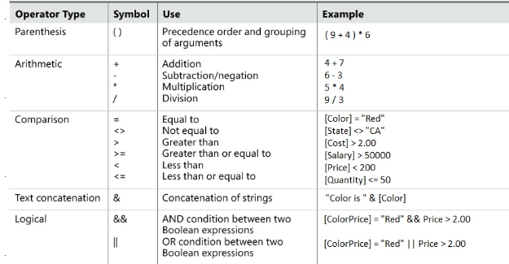

<br/>

## - **Syntax:**
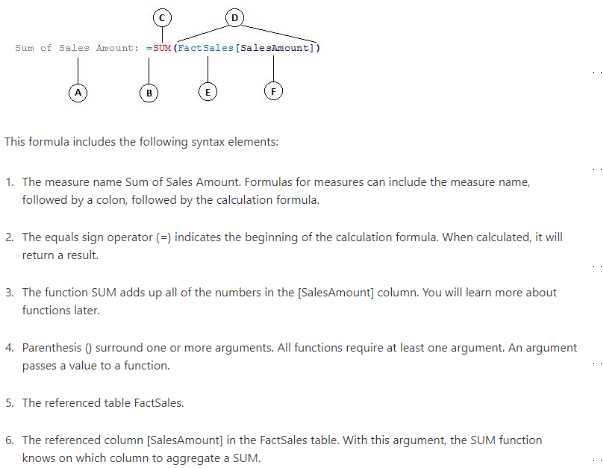

<br/>

## - **Rules to cearte Measures:**
1. Create a new matrix on a new sheet.
2. Put Category on Rows.
3. Right-click on Table "All Measure" and select New Measure.
4. Give the measure a descriptive name.
5. Start typing the function and pause so you can read the IntelliSense description of the function and the syntax.
6. Immediately after writing the function, click back into the formula bar and apply any formatting you want to use.
7. Add the measure to your matrix so you can see the results.

<br />

### - **SUM**: sum all elements.

```
SUM(COLUMN_NAME)
```

<br />

### - **AVERAGE:** return the mean of elemnts in columns.
```
AVERAGE(COLUMN_NAME)
```

<br />

### - **MAX & MIN:** reuturns the max and min numbers in Columns. 
```
MAX(Column_name)
MIN(COlumn_name)
```

<br />

### - **SUMX:** returns the sum of expression evaluated for each row in a table.
```
SUM(table_name,expression)
```

<br />

### - **DIVIDE:**
```
DIVIDE(numerator, denominator, alternateresults)
```

<br />

### - **COUNT & COUNTROW:** counts the number of cells on  a column that contains numbers.

```
COUNT(Column_name)
COUNTROW(table_name)
```

<br />

### - **CALCULATE:** evalute an expression in a context that is modified by the specified filters.

```
CALCULATE(expression,filter1,filter2,...)
```

<br />

### - **FILTER:** reuturns a table that represents a subset of another table or epressions.
```
FILTER(table_name,filter)
```

<br />

### - **ALL**: reutrns all rows in tables or values in columns. It is useful for clearing filters and create calculations on all the rows in table.
```
ALL(tbale_name | column_name)
```

